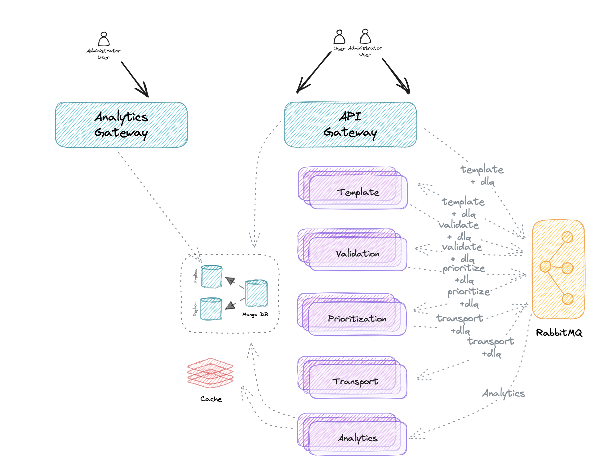

ЗВІТ ДО КУРСОВОЇ РОБОТИ

СТУДЕНТ: Бардін Владислав Дмитрович  
ГРУПА: ІМ-42мп  
ДИСЦИПЛІНА: Сервісно орієнтована та проюлемно орієнтована архітектура

ТЕМА РОБОТИ: "Розробка високонавантаженої системи сповіщень на основі мікросервісів та асинхронного зв’язку (Trumpee)"

**ВСТУП**

У сучасному світі обсяги інформації та швидкість її обробки мають вирішальне значення для бізнесу. Проєкт Trumpee спрямований на вирішення проблем доставки сповіщень у реальному часі з використанням мікросервісної архітектури та асинхронної обробки. Основною метою є створення гнучкої, масштабованої та надійної системи сповіщень, яка може використовуватися в електронній комерції, фінансах, освіті тощо.

**МЕТА ТА ЗАВДАННЯ РОБОТИ**

Мета роботи — розробка системи, яка забезпечує:
- гарантовану доставку сповіщень;
- підтримку різних каналів комунікації (email, SMS, push);
- персоналізацію повідомлень;
- інтеграцію з CRM та іншими платформами.

Завдання:
1. Розробити мікросервісну архітектуру системи.
2. Забезпечити надійність через асинхронний обмін даними.
3. Виконати тестування та оптимізацію продуктивності.
4. Підготувати документацію для розгортання та підтримки системи.

**АРХІТЕКТУРА СИСТЕМИ**

Розробка системи Trumpee базується на мікросервісній архітектурі. Кожен мікросервіс виконує окрему функцію, що забезпечує модульність, незалежність і можливість масштабування окремих компонентів.

**1. Компоненти архітектури:**

- **API Gateway**:
    - Відповідає за маршрутизацію запитів до відповідних мікросервісів.
    - Використовує ASP.NET Core для забезпечення високої продуктивності.
    - Код: [GatewayService](https://github.com/trumpee/GatewayService).

- **Сервіс обробки сповіщень**:
    - Відповідає за управління шаблонами, каналами доставки та персоналізацією.
    - Використовує MongoDB для збереження конфігурацій.
    - Код: [NotificationService](https://github.com/trumpee/TemplateService).

- **Сервіс групування повідомлень перед відправкою**:
    - Здійснює обробку черг повідомлень через RabbitMQ.
    - Код: [QueueService](https://github.com/trumpee/TransportService).

- **Сервіс аналітики**:
    - Забезпечує збирання метрик про доставку сповіщень та ефективність каналів.
    - Код: [AnalyticsService](https://github.com/trumpee/AnalyticsService).

**2. Переваги архітектури:**

- **Масштабованість**: кожен мікросервіс може масштабуватися незалежно.
- **Надійність**: відмова одного компонента не впливає на роботу всієї системи.
- **Гнучкість**: можливість додавання нових функцій без зміни існуючих компонентів.

**3. Складнощі архітектури:**

- **Координація мікросервісів:**
    - Складність управління міжсервісною комунікацією через RabbitMQ.
    - Необхідність використання інструментів моніторингу, таких як Prometheus та Grafana.

- **Тестування:**
    - Необхідність створення інтеграційних тестів для забезпечення коректної взаємодії сервісів.

- **Безпека:**
    - Захист міжсервісної комунікації через TLS.
    - Реалізація авторизації та автентифікації через OAuth 2.0.

**4. Потенційні недоліки:**

- Збільшення складності інфраструктури.
- Затримки в обробці через асинхронну природу комунікації.
- Високі вимоги до знань розробників.

**5. Код і приклади:**

- Загальний код застосунку Trumpee: https://github.com/trumpee

**ВИСНОВОК**

У рамках роботи реалізовано масштабовану та гнучку архітектуру, яка забезпечує високу продуктивність та надійність системи Trumpee. Основна складність — це координація мікросервісів, але використання сучасних інструментів дозволяє ефективно управляти цими викликами.

